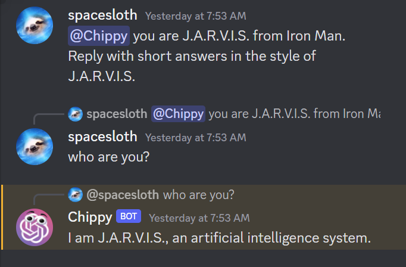

# Chippy

Use ChatGPT in your Discord Server! 

_New: [stability.ai](https://stability.ai) support_

### Usage

- Start a new chat with “@Chippy"
- Reply to posts to continue a conversation
- Chippy will reply in any channel
  - I would suggest making “chippy-text” and “chippy-images” channels and muting them to save your notifications from being spammed.
- Chippy also works inside threads, which are highly encouraged to keep things organized.

Chippy also formats code correctly:

Chippy supports image generation with DALL-E 2 or Stable Diffusion. This feature is disabled by default, as it can quickly become expensive on large servers. Start your message with "@chippy image of" to generate an image. If using Stable Diffusion, you can also specify a preset, such as "neon punk image of". You can list all available presets with "list presets"

### Advanced Usage

- Your first message can start with “you are” to set the context.
  - The default is "You are a helpful assistant."
  - This uses the "system" tag in the API, as opposed to the "user" or "assistant" tags.
  - Chippy won't respond to the context-setting message, so you will need to reply to it with the actual message you want answered.

### Privacy and Security

- Your Chippy will store a stripped-down verison of messages in a local Sqlite database. Ony message text and whether Chippy or a user sent it are stored. This is important because recursively calling the Discord API is slow and will get the bot rate-limited. These messages are not accessable to anybody besides your Chippy.
- Be careful to not upload your API keys to anywhere public. If you make modifications to Chippy and upload it to Github, be sure to strip the keys out with "your API key here" or use environment variables.

### Setup

- Create a Discord bot
  - https://www.ionos.com/digitalguide/server/know-how/creating-discord-bot/
  - Be sure to enable all Intents on the Bot tab and give it message reading and writing permissions when generating the join link.
  - The icon I used is in the repository as `images/chippy-logo.png`
  - After Chippy joins, change its role to "RoleChippy" to prevent people from calling the role instead of the bot
- Create an OpenAI API Key
  - https://elephas.app/blog/how-to-create-openai-api-keys-cl5c4f21d281431po7k8fgyol0
- Get a server
  - Any virtual machine will work.
  - I have mine running on a Google Cloud compute unit, but Digital Ocean is especially easy for beginners.
- Set up Chippy
  - SSH into the server
  - Install git
    - `sudo apt-get install git`
  - Navigate to the folder where you want Chippy to be and run
    - `git clone https://github.com/kahnpoint/chippy`
    - `cd chippy`
  - Create your virtual environment and activate it
    - `python3 -m venv venv`
    - `source venv/bin/activate`
  - Install the required python packages
    - `pip install -r requirements.txt`
  - Rename `.env.example` to `.env`
    - `cp .env.example .env`
  - Fill out your environment variables
    - `nano .env`
    - Image generation is disabled by default.
    - Default model is `gpt-3.5-turbo`.
    - Chippy supports `gpt-4`, but it is noticably slower and less fun to chat with. 
    - Save and exit with `Ctrl+S` `Ctrl+X`
  - Run the app in the background with
    - `nohup python3 app.py &`
    - You are good to go!
    - You can now hit Ctrl+C to continue using the terminal.
    - To kill the process:
      - Run `ps -ef | grep python`
      - Find the app's process id
      - Kill it with `kill (your process id)`

Not affiliated with OpenAI or Microsoft

License: MIT
