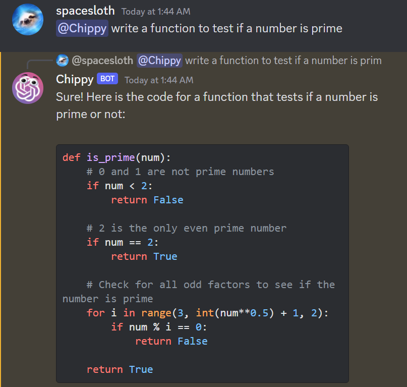

# Chippy

Use ChatGPT in your Discord Server with your friends!

### Usage

* Start a new chat with “@Chippy" 
* Reply to posts to continue a conversation 
* Chippy will reply in any channel
  * I would suggest making “chippy-text” and “chippy-images” channels and muting them to save your notifications
* Chippy also works inside threads, which is highly encouraged


Chippy also formats code correctly:



Chippy supports image generation with DALL-E 2. This feature is disabled by default and can quickly become expensive on large servers.


### Advanced Usage
 * Your first message can start with “you are” to set the context (“system” tag in the API)

### Setup
* Create a Discord bot
  * https://www.ionos.com/digitalguide/server/know-how/creating-discord-bot/
  * Be sure to enable the Message Content Intent on the Bot tab 
  * When creating the join link, be sure to give it adequate text permissions 
  * The icon I used is in the repository as ```images/chippy-logo.png```
  * After Chippy joins, change its role to "RoleChippy" to prevent people from calling the role instead of the bot
* Create an OpenAI API Key
  * https://elephas.app/blog/how-to-create-openai-api-keys-cl5c4f21d281431po7k8fgyol0
* Get a server
  * Any virtual machine will work
  * I have mine running in a Google Cloud compute unit
  * Digital Ocean is especially easy for beginners 
* Set up Chippy
  * SSH into the server
  * Install the python packages
    * ```pip install openai discord.py requests```
    * Make sure openai is at least 0.27
  * Navigate to the folder where you want Chippy to be
    * ```mkdir chippy```
    * ```cd chippy```
  * Put the app.py file from this repository into the folder
  * Create a folder called images, which is where generated images will be saved, if enabled
    * ```mkdir images```
  * Open app.py to input your keys and make sure all the settings are what you want
    * ```sudo nano app.py```
    * Save and exit with ```Ctrl+S``` ```Ctrl+X```
  * Run it in the background with
    * ```nohup python3 app.py &```
    * You can now hit Ctrl+C and continue using the terminal
    * To kill the process run ```ps -ef | grep python``` and ```kill (your process id)```
    
License: WTFPL
